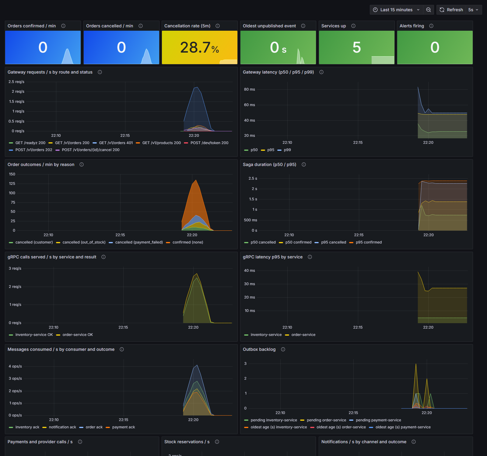
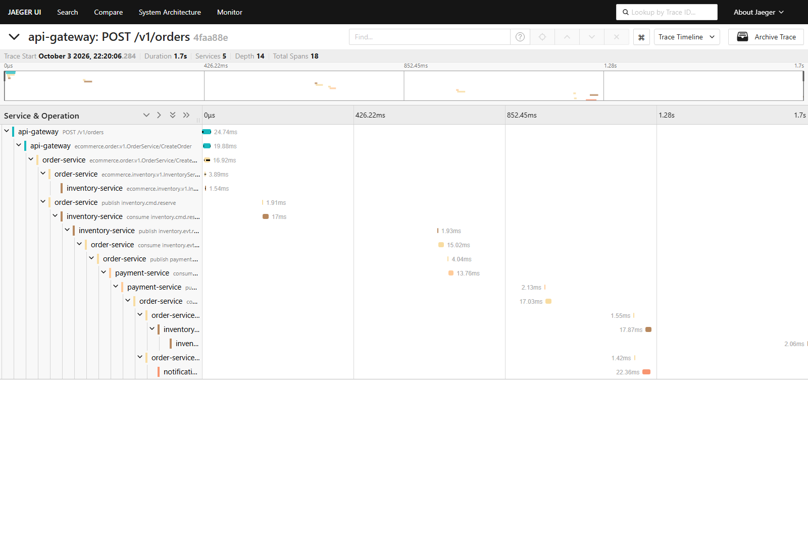

# Go E-Commerce Microservices

[](https://github.com/HuzaifaMH/go-ecommerce-microservices/actions/workflows/ci.yml)


An event-driven e-commerce backend in Go. Five services cooperate over **gRPC** and **NATS JetStream** to place, pay for and fulfil an order, using an **orchestrated saga** with compensation, the **transactional outbox** pattern and **idempotent consumers**. Every design choice is written up as an [Architecture Decision Record](docs/adr/README.md).

**v0.1.0** · 5 services · 16 ADRs · 12 required CI checks · 26 end-to-end scenarios · 8 unit-tested alert rules



*The bundled Grafana dashboard after a minute of mixed traffic: successful, declined, out-of-stock and customer-cancelled orders.*

## Contents

[Architecture](#architecture) · [Try it](#try-it) · [Design principles](#design-principles) · [Observability](#observability) · [Repository layout](#repository-layout) · [Development](#development) · [Documentation](#documentation) · [Roadmap](#roadmap)

## Architecture


| Service | Responsibility |
|---|---|
| [`api-gateway`](services/gateway/README.md) | Public REST edge: RS256 JWT auth, rate limiting, request IDs; translates to gRPC |
| [`order-service`](services/order/README.md) | Order lifecycle and saga orchestrator |
| [`inventory-service`](services/inventory/README.md) | Stock levels, reservations and releases |
| [`payment-service`](services/payment/README.md) | Charges and refunds through a pluggable (simulated) provider |
| [`notification-service`](services/notification/README.md) | Email/SMS notifications from domain events |

A customer places an order; the order is stored as `PENDING` together with an outbox message. Inventory reserves stock, then payment charges the customer. On success the order is `CONFIRMED`; if payment fails the stock is released and the order is `CANCELLED`. Notification reacts to the resulting events.

More views, including system context, service internals, deployment and the saga sequence: **[docs/architecture](docs/architecture/README.md)**.

## Try it

Requirements: Docker. (Go 1.26+ only for development.)

```bash
make up    # build and start everything: NATS, Postgres, 5 services, Jaeger, Prometheus, Grafana
```

Place an order and open its trace:

```bash
TOKEN=$(curl -s -X POST localhost:8080/dev/token -H 'Content-Type: application/json' -d '{"subject":"alice"}' | jq -r .access_token)
curl -si -X POST localhost:8080/v1/orders -H "Authorization: Bearer $TOKEN" -H 'Idempotency-Key: demo-1' \
     -H 'Content-Type: application/json' -d '{"items":[{"sku":"BOOK-GO-001","quantity":1}]}' | grep -i x-trace-id
# open http://localhost:16686/trace/<that trace id>
```

Use a customer starting with `decline-` to watch the rollback path in a single trace: payment fails, stock is released, the order is cancelled and the customer is notified.

```bash
make down  # stop everything
```

## Design principles

| Principle | How it shows up | Why |
|---|---|---|
| Typed contracts | gRPC + Protobuf inside, REST/JSON at the edge | Generated code, deadlines, breaking-change checks with `buf` |
| No distributed transactions | Orchestrated saga with compensation | Each service commits locally; failures are rolled back by explicit steps |
| No lost or duplicate events | Transactional outbox, idempotent inbox, JetStream de-duplication | State change and message commit together; redelivery is harmless |
| Clear data ownership | PostgreSQL per service, `sqlc` queries, `goose` migrations | No shared tables; type-safe SQL |
| Enforced boundaries | `internal/` per service, layer test in `test/architecture` | The compiler and CI reject coupling |
| Secure by default | RS256-only JWT (algorithm pinned), ownership checks, rate limits | See [SECURITY.md](SECURITY.md) and [ADR-0015](docs/adr/0015-gateway-edge-security.md) |
| Observable | One order is one trace across all services; RED and business metrics; tested alerts | You can answer "what happened to order X?" in seconds |
| Resilient start-up | Retry with backoff for Postgres and NATS | Container start order does not matter |

Each row links to a decision with alternatives and consequences in the [ADR index](docs/adr/README.md).

## Observability

`make up` also starts the monitoring stack:

| What | Where | Notes |
|---|---|---|
| **Jaeger** (traces) | http://localhost:16686 | One order is one trace across all services. Search service `api-gateway`, or the tag `order.id=<order id>` |
| **Grafana** (dashboards) | http://localhost:3000 | Opens on the "E-Commerce overview" dashboard (no login needed to view) |
| **Prometheus** (metrics, alerts) | http://localhost:9099 | Alert rules at `/alerts` |



Every API response carries `X-Trace-Id` and `X-Request-Id`; paste the trace ID into Jaeger. Log lines written during a request carry the same `trace_id`. Alerts are unit-tested with `promtool` (`make rules-test`). Design and trade-offs: [ADR-0016](docs/adr/0016-observability.md).

## Repository layout

```text
api/proto/            Protobuf contracts (buf)
gen/                  Generated Go code
services/<service>/   One self-contained directory per service
  cmd/<service>/        entrypoint (wiring only)
  internal/domain/      entities and business rules
  internal/app/         use cases and ports
  internal/adapters/    gRPC, JetStream, Postgres implementations
  migrations/           SQL migrations
pkg/                  Shared, service-agnostic libraries
deploy/               Docker Compose, Dockerfile, Prometheus and Grafana config
test/                 Architecture and end-to-end tests
docs/                 Architecture views and ADRs
```

Service boundaries are enforced by the Go compiler (`internal/`); layer boundaries inside a service by `test/architecture`. See [ADR-0007](docs/adr/0007-service-code-structure.md).

## Development

Requirements: Go 1.26+, Docker.

```bash
make tools      # install pinned buf, protoc plugins and sqlc into ./bin
make proto      # regenerate gen/ from api/proto
make sqlc       # regenerate typed query code
make test       # all tests with the race detector (integration tests need Docker)
make test-short # fast tests only
make e2e        # build the stack and run end-to-end tests against it
make lint       # golangci-lint
```

Run `make help` for all targets. Contribution workflow and commit conventions: [CONTRIBUTING.md](CONTRIBUTING.md). Releases are listed in the [changelog](CHANGELOG.md).

## Documentation

| Document | Contents |
|---|---|
| [docs/architecture](docs/architecture/README.md) | Context, containers, service internals, deployment, saga |
| [docs/adr](docs/adr/README.md) | 16 decision records with alternatives and consequences |
| Service READMEs | Per-service behaviour, configuration and guarantees (linked in the table above) |
| [SECURITY.md](SECURITY.md) | Security design and how to report a problem |

## Roadmap

Done: scaffold and CI, contracts and shared packages, inventory, payment, order and saga, notification, gateway, observability, release v0.1.0.

Not started: Kubernetes manifests, an Angular admin UI.

## License

[MIT](LICENSE)
