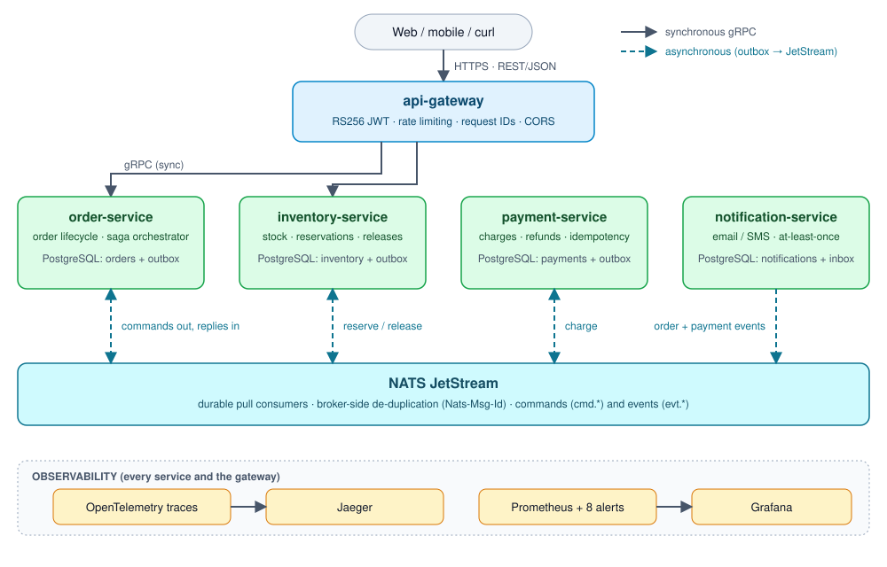
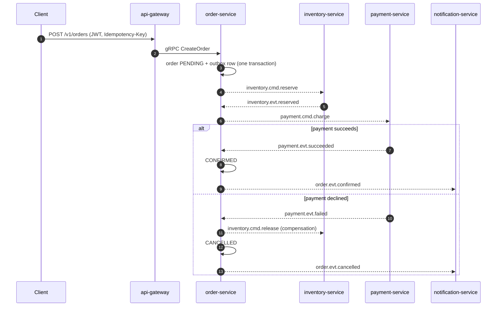

# Go E-Commerce Microservices

[](https://github.com/HuzaifaMH/go-ecommerce-microservices/actions/workflows/ci.yml)


An event-driven e-commerce backend built in Go. Order, inventory, payment and notification services communicate over **gRPC** and **NATS JetStream**, using an **orchestrated saga**, the **transactional outbox** pattern and idempotent consumers.

> **Status:** feature-complete [v0.1.0](CHANGELOG.md). Five services, 16 ADRs, 12 required CI checks, 26 end-to-end scenarios. See the [roadmap](#roadmap).


*The bundled Grafana dashboard after a minute of mixed traffic: successful, declined, out-of-stock and customer-cancelled orders.*

## Architecture



Solid arrows are synchronous gRPC calls. Dashed arrows are asynchronous messages: a service writes the message to its own database in the same transaction as the state change (outbox), a relay publishes it to JetStream, and consumers de-duplicate on the message ID (inbox). Each service owns its database; no service reads another's tables.
| Service | Responsibility |
|---|---|
| `api-gateway` | Public REST edge, JWT auth, rate limiting, translates to gRPC |
| `order-service` | Order lifecycle and saga orchestrator |
| `inventory-service` | Stock levels, reservations and releases |
| `payment-service` | Charges and refunds via a pluggable (simulated) provider |
| `notification-service` | Email/SMS notifications from domain events |

### Order flow

1. Client creates an order; it is stored as `PENDING` together with an outbox message.
2. Inventory reserves stock, then payment charges the customer.
3. On success the order becomes `CONFIRMED`. If payment fails, stock is released and the order is `CANCELLED`.
4. Notification reacts to the resulting events.

### Saga: happy path and rollback



One order is one distributed trace across all five services:


Full details: [docs/architecture.md](docs/architecture.md).

## Key design decisions

| Decision | Choice | Why |
|---|---|---|
| Internal APIs | gRPC + Protobuf | Typed contracts, deadlines, generated code |
| Public API | REST via gateway | Client compatibility |
| Messaging | NATS JetStream | Lightweight, durable, built-in de-duplication |
| Consistency | Orchestrated saga + outbox/inbox | No distributed transactions; no lost or duplicate events |
| Data | PostgreSQL per service, pgx + sqlc | Clear ownership, type-safe SQL |

Every decision, with alternatives and consequences, is recorded in [docs/adr](docs/adr/README.md).

## Getting started

Requirements: Go 1.26+, Docker.

```bash
make tools      # install pinned buf, protoc plugins and sqlc into ./bin
make proto      # regenerate gen/ from api/proto
make sqlc       # regenerate typed query code
make up         # start NATS JetStream and PostgreSQL
make test       # run all tests with the race detector (integration tests need Docker)
make e2e        # build the stack and run end-to-end tests against it
make test-short # fast tests only
make down       # stop everything
```

Run `make help` for all targets.

## Repository layout

```
api/proto/            Protobuf contracts (buf)
gen/                  Generated Go code
services/<service>/   One self-contained directory per service
  cmd/<service>/        entrypoint (wiring only)
  internal/domain/      entities and business rules
  internal/app/         use cases and ports
  internal/adapters/    gRPC, JetStream, Postgres implementations
  migrations/           SQL migrations
pkg/                  shared, service-agnostic libraries
deploy/               Docker Compose, Dockerfile, Prometheus and Grafana config
test/                 architecture and end-to-end tests
docs/                 architecture and ADRs
```

Service boundaries are enforced by the Go compiler (`internal/`); layer boundaries inside a service are enforced by `test/architecture`. See [ADR-0007](docs/adr/0007-service-code-structure.md).

## Observability

`make up` also starts the monitoring stack:

| What | Where | Notes |
|---|---|---|
| **Jaeger** (traces) | http://localhost:16686 | One order is one trace across all services. Search service `api-gateway`, or the tag `order.id=<order id>` |
| **Grafana** (dashboards) | http://localhost:3000 | Opens on the "E-Commerce overview" dashboard (no login needed to view) |
| **Prometheus** (metrics, alerts) | http://localhost:9099 | Alert rules at `/alerts` |

Every API response carries `X-Trace-Id` and `X-Request-Id`; paste the trace ID into Jaeger. Log lines written during a request carry the same `trace_id`.

Try it:

```bash
TOKEN=$(curl -s -X POST localhost:8080/dev/token -H 'Content-Type: application/json' -d '{"subject":"alice"}' | jq -r .access_token)
curl -si -X POST localhost:8080/v1/orders -H "Authorization: Bearer $TOKEN" -H 'Idempotency-Key: demo-1' \
     -H 'Content-Type: application/json' -d '{"items":[{"sku":"BOOK-GO-001","quantity":1}]}' | grep -i x-trace-id
# open http://localhost:16686/trace/<that trace id>
```

Use a customer starting with `decline-` to see the rollback path (payment failed, stock released, order cancelled, customer notified) in a single trace. Alerts are unit-tested: `make rules-test`. Design and trade-offs: [ADR-0016](docs/adr/0016-observability.md).

## Roadmap

- [x] Phase 0 — repository scaffold, CI, local infrastructure, ADRs
- [x] Phase 1 — protobuf contracts and shared packages (config, logging, health, runner, messaging, outbox/inbox)
- [x] Phase 2 — [inventory-service](services/inventory/README.md)
- [x] Phase 3 — [payment-service](services/payment/README.md)
- [x] Phase 4 — [order-service](services/order/README.md) and the saga
- [x] Phase 5 — [notification-service](services/notification/README.md)
- [x] Phase 6 — [api-gateway](services/gateway/README.md)
- [x] Phase 7 — observability (OpenTelemetry, Prometheus, Grafana, Jaeger); see [Observability](#observability)
- [x] Release v0.1.0 — see the [changelog](CHANGELOG.md)
- [ ] Not started: Kubernetes manifests, Angular admin UI

## License

[MIT](LICENSE)
