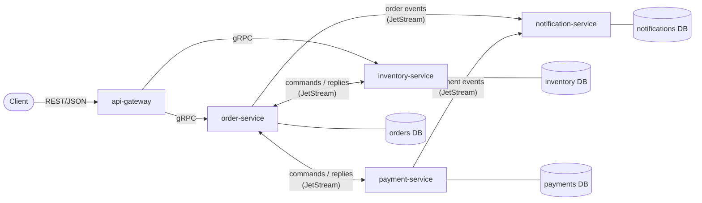

# Go E-Commerce Microservices

[](https://github.com/HuzaifaMH/go-ecommerce-microservices/actions/workflows/ci.yml)


An event-driven e-commerce backend built in Go. Order, inventory, payment and notification services communicate over **gRPC** and **NATS JetStream**, using an **orchestrated saga**, the **transactional outbox** pattern and idempotent consumers.

> **Status:** under active development. See the [roadmap](#roadmap).

## Architecture



| Service | Responsibility |
|---|---|
| `api-gateway` | Public REST edge, JWT auth, rate limiting, translates to gRPC |
| `order-service` | Order lifecycle and saga orchestrator |
| `inventory-service` | Stock levels, reservations and releases |
| `payment-service` | Charges and refunds via a pluggable (simulated) provider |
| `notification-service` | Email/SMS notifications from domain events |

### Order flow

1. Client creates an order; it is stored as `PENDING` together with an outbox message.
2. Inventory reserves stock, then payment charges the customer.
3. On success the order becomes `CONFIRMED`. If payment fails, stock is released and the order is `CANCELLED`.
4. Notification reacts to the resulting events.

Full details: [docs/architecture.md](docs/architecture.md).

## Key design decisions

| Decision | Choice | Why |
|---|---|---|
| Internal APIs | gRPC + Protobuf | Typed contracts, deadlines, generated code |
| Public API | REST via gateway | Client compatibility |
| Messaging | NATS JetStream | Lightweight, durable, built-in de-duplication |
| Consistency | Orchestrated saga + outbox/inbox | No distributed transactions; no lost or duplicate events |
| Data | PostgreSQL per service, pgx + sqlc | Clear ownership, type-safe SQL |

Every decision, with alternatives and consequences, is recorded in [docs/adr](docs/adr/README.md).

## Getting started

Requirements: Go 1.24+, Docker.

```bash
make up      # start NATS JetStream and PostgreSQL
make test    # run unit tests with the race detector
make down    # stop everything
```

Run `make help` for all targets.

## Repository layout

```
cmd/<service>/        entrypoints (wiring only)
internal/<service>/   domain, application and adapters per service
pkg/                  shared infrastructure (logging, config, messaging, ...)
proto/                Protobuf definitions
deploy/               Docker Compose, Kubernetes manifests
docs/                 architecture and ADRs
```

## Roadmap

- [x] Phase 0 — repository scaffold, CI, local infrastructure, ADRs
- [ ] Phase 1 — protobuf contracts and shared packages (outbox/inbox, config, health)
- [ ] Phase 2 — inventory-service
- [ ] Phase 3 — payment-service
- [ ] Phase 4 — order-service and saga
- [ ] Phase 5 — notification-service
- [ ] Phase 6 — api-gateway
- [ ] Phase 7 — observability (OpenTelemetry, Prometheus, Grafana, Jaeger)
- [ ] Phase 8 — Kubernetes manifests and release pipeline
- [ ] Phase 9 — Angular admin UI

## License

[MIT](LICENSE)
