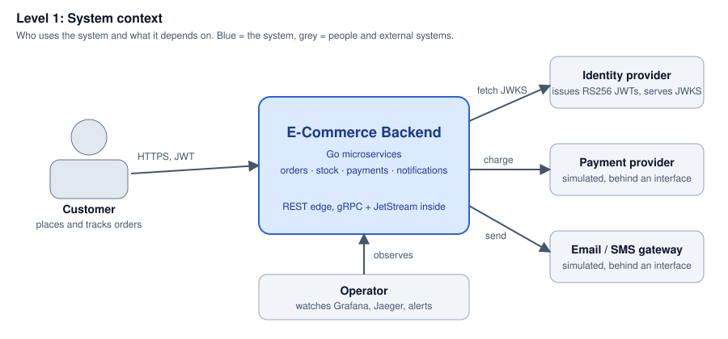
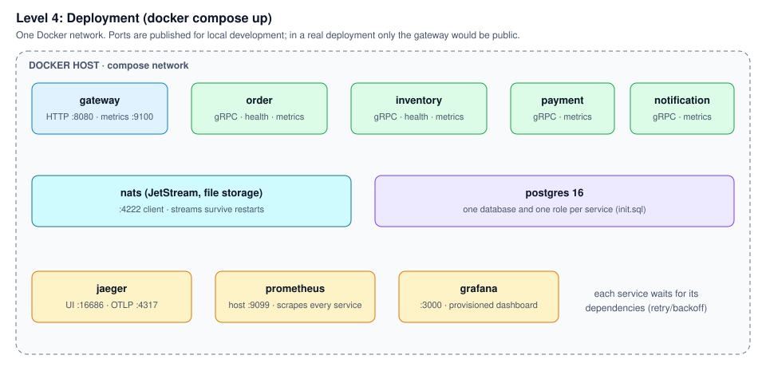
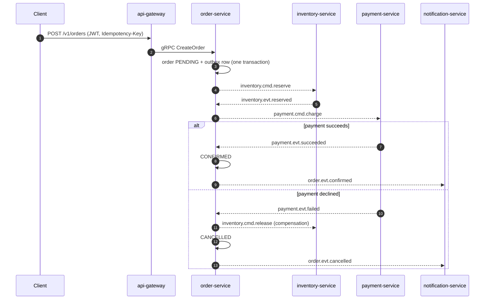

# Architecture

The system is described at four levels, from broad to detailed (the [C4 model](https://c4model.com/)). Start at the top and stop when you have the answer you need.

| Level | View | Answers |
|---|---|---|
| 1 | [System context](#1-system-context) | Who uses it, what does it depend on? |
| 2 | [Containers](#2-containers) | Which deployable pieces exist and how do they talk? |
| 3 | [Inside a service](#3-inside-a-service) | How is each service's code organised? |
| 4 | [Deployment](#4-deployment) | What runs where, on which ports? |

Behaviour over time is in [the order saga](#the-order-saga). Why each choice was made is in the [ADRs](../adr/README.md), for example [the saga](../adr/0004-orchestrated-saga.md) and [the outbox](../adr/0005-transactional-outbox-and-idempotent-consumers.md); the original planning document is [design.md](design.md).

## 1. System context



## 2. Containers


| Container | Owns | Talks to |
|---|---|---|
| `api-gateway` | Public REST contract, authentication, rate limits | `order`, `inventory` over gRPC |
| `order-service` | Orders, saga state, `orders` database | `inventory` and `payment` through JetStream commands; `inventory` over gRPC for pricing and stock lookups |
| `inventory-service` | Stock levels and reservations, `inventory` database | Replies to commands on JetStream |
| `payment-service` | Charges and refunds, `payments` database | Replies to commands on JetStream |
| `notification-service` | Notification records, `notifications` database | Consumes order and payment events |

Rules that keep the boundaries honest:

- **A database belongs to one service.** No service reads another's tables ([ADR-0006](../adr/0006-database-per-service-postgres.md)).
- **Commands are addressed, events are announced.** `*.cmd.*` subjects have one consumer; `*.evt.*` subjects may have many.
- **State change and message are one transaction.** Services write an outbox row with the state change; a relay publishes it. Consumers record the message ID in an inbox so redelivery is harmless.
- **Contracts live in `api/proto`** and are checked by `buf` in CI, including breaking-change detection.

## 3. Inside a service

Every service has the same shape, and `test/architecture` fails the build if a layer imports one it should not.

```text
services/<name>/
  cmd/<name>/          main.go: wiring only, no logic
  internal/
    domain/            entities and business rules; imports nothing from this repo
    app/               use cases and the ports (interfaces) they need
    adapters/          gRPC, JetStream, Postgres, metrics: implement the ports
    config/            environment-driven configuration
  migrations/          goose SQL, embedded in the binary
```

Dependencies point inward: `adapters` → `app` → `domain`. Because of Go's `internal/` rule, one service cannot import another's code at compile time; they share only `pkg/` and the generated contracts in `gen/`.

## 4. Deployment



## The order saga



If stock is unavailable, `inventory.evt.rejected` cancels the order before any payment is attempted. A customer can cancel while the order is `PENDING` or `STOCK_RESERVED`. End to end the saga takes about a second; the outbox relay's 500 ms poll dominates.


